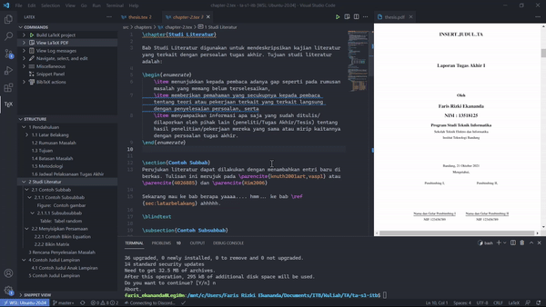

Template LaTeX Tesis & Paper Informatika ITB
===================================

oleh:

- Petra Novandi <me@petrabarus.net>
- Faris Rizki Ekananda <work@farisekananda.dev>

Edited By:

- Muhammad Garebaldhie ER Rahman <mgarebaldhie80@gmail.com>

original repo:

- Thesis <https://github.com/petrabarus/if-itb-latex/>  
- Thesis <https://github.com/darkGrimoire/ta1-latex-itb>
- Latex <https://github.com/alvinwilta/ieee-conference-latex>

Dokumen ini merupakan templat LaTeX yang ditujukan untuk laporan
tesis dan paper di program studi Teknik Informatika ITB. Template ini penulis
gunakan dalam penulisan laporan tesis dan paper penulis dan dengan semangat
berbagi penulis memutuskan untuk mempublikasikan template ini agar
dapat digunakan oleh banyak orang.

Silakan mengunduh, menggunakan, memodifikasi, dan menyebarkan
templat ini. :)

Contoh Hasil Build
---------

Berikut merupakan contoh ketiga file hasil build

- [Thesis](./thesis.example.pdf)
- [Yudisium](./yudisium.example.pdf)
- [Paper](./paper.example.pdf)

Instalasi
---------

Program telah diuji dalam sistem operasi Linux Ubuntu 20.04, Windows 10, Mac OS Ventura 13.3 dan Sonoma 14.5.

## Linux

Untuk melakukan instalasi *package* jalankan perintah berikut

```
sudo apt-get -qq update && sudo apt-get install -y --no-install-recommends \
    texlive-fonts-recommended texlive-latex-extra texlive-fonts-extra \
    dvipng texlive-latex-recommended texlive-lang-other \
    texlive-bibtex-extra biber xzdec
```

## Windows

Untuk Windows, Anda dapat melakukan instalasi TeXLive pada [link berikut](https://mirror.ctan.org/systems/texlive/tlnet/install-tl-windows.exe). Manual Instalasi dapat dilihat pada [link berikut](https://www.tug.org/texlive/windows.html). Jangan lupa cek environment variable Anda dan pastikan terdapat PATH menuju `<texlive_installation_directory>\2021\bin\win32`

## Mac

Untuk melakukan instalasi pada Mac, diperlukan library bernama `mactex`. Mactex dapat diinstall dengan dua cara

### Brew

Jika ingin menginstall `mactex` dengan [brew](https://brew.sh/) masukan perintah berikut

```
brew install --cask mactex
```

### Pkg

Jika ingin melakukan instalasi secara manual dapat mengunjungi laman [mactex download page](https://tug.org/mactex/mactex-download.html).

Setelah download selesai lakukan instalasi default

Penggunaan
----------

Templat ini telah dilengkapi oleh skrip untuk melakukan kompilasi
Makefile. Untuk melakukan kompilasi cukup eksekusi perintah berikut

```bash
# untuk linux dan mac
make

# untuk windows
make.bat
```

Hasil kompilasi akan berada pada directory `output`.

Integrasi VSCode LaTeX Workshop
----------



Template ini telah diintegrasikan dengan VSCode extension LaTeX Workshop sehingga dapat melakukan build otomatis, memakai synctex, serta linter. Terdapat 2 file konfigurasi setelan vscode yang terdapat pada folder .vscode. Defaultnya adalah setelan UNIX, namun Anda dapat menggantinya dengan setelan windows.

Karena terdapat tiga build command, jika ingin mengaktifkan fitur hot reload, maka perlu melakukan build file terkait dengan ekstensi LaTeX Workshop terlebih dahulu sebelum bisa mengaktifkan fitur hot reload. Pilih file mana yang akan dibuild (e.g. thesis) lalu tekan `Recipe: latex_itb_ta Thesis`. Setelah build selesai, maka fitur hot reload akan aktif untuk file tersebut.

Shortcut Latex Workshop yang berguna
----------

`ctrl + alt + v` pada `*.tex` -> buka file `pdf` interaktif  
`ctrl + alt + j` pada `*.tex` -> pergi ke lokasi kursor pada `pdf` yang dibuka  
`ctrl + klik kanan` pada `*.pdf` -> pergi ke lokasi kursor pada file `.tex` yang sesuai  

Troubleshooting
----------

**Q: Bagaimana cara menghilangkan border merah pada hyperlink di pdf?**  
A: Pada file `config/if-itb-thesis.sty`, Ubah `\usepackage{hyperref}` menjadi `\usepackage[hidelinks]{hyperref}`.

Kontribusi
----------

Templat ini dapat digunakan secara gratis, akan tetapi penulis sangat
berharap adanya kritik serta saran dari pengguna untuk meningkatkan
kualitas hasil dan penggunaan templat ini.

Kritik dan saran tersebut dapat dikirim melalui URL
.

Terima Kasih
-----------

- Steven Lolong atas pemberian templat LaTeX yang asli.
- Peb Ruswono Aryan atas bantuan pelengkapan struktur dokumen.
- Petra Novandi atas template awal yang diberikan
- Faris Riski Ekananda atas template dokumen yang telah dimodifikasi
- Alvin Wilta atas template IEEE Latex for VSCode
